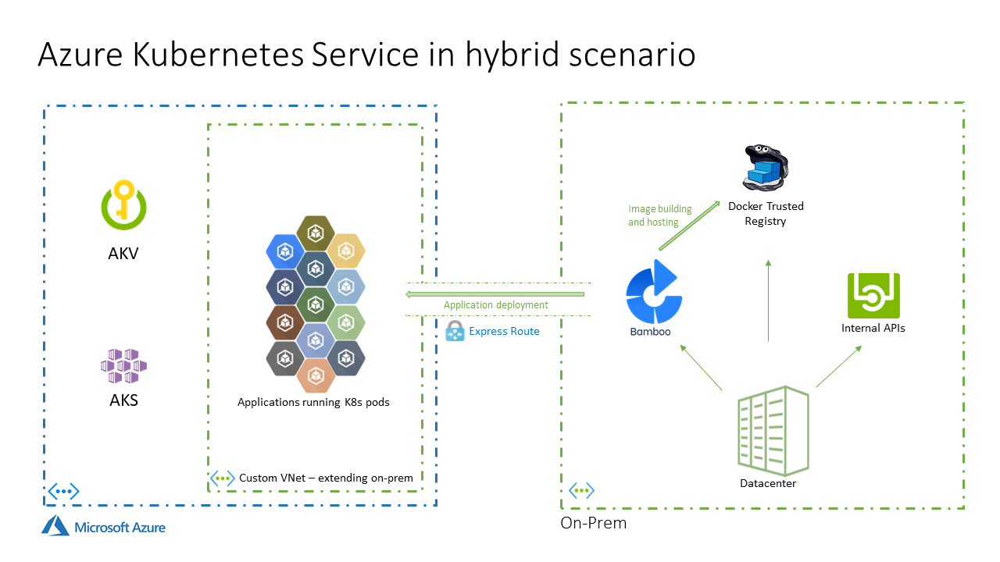

# AKS playing nice with On-Prem services 

A repo to put together hacks and tips on how to deploy a hybrid scenario of an Azure Kubernetes Service playing with Docker Trusted Registry on Prem

This is a simple diagram of what we want to accomplish regarding infrastructure:

## Deploying a test environment

If needed we can follow these instructions to replicate a testing environment.

- [Deploy Environment](deploy-env/README-deploy.md)

## DevOps using Bamboo

- [Bamboo pipeline](devops/README-devops.md)

